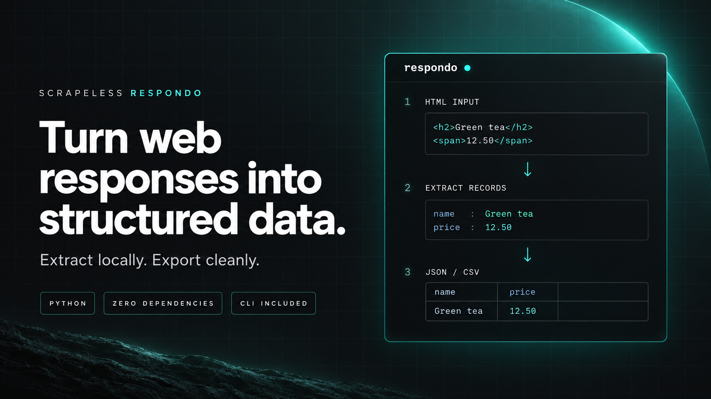

# Scrapeless Respondo

<div align="center">

[](https://www.python.org/)
[](#command-line)

[](LICENSE)

<br>



**Turn HTML and JSON into clean, usable datasets — locally, with Python.**

[Scrapeless](https://www.scrapeless.com/en) · [Quick Start](#quick-start) · [CLI](#command-line) · [API Guide](docs/API.md) · [Optional AI](#ai-parsing)

</div>

---

Respondo is Scrapeless's local Python extraction toolkit. Give it the HTML or JSON
from your web-data workflow; extract the fields you need, reshape the results,
and export records your applications can use. No runtime dependencies. No account
needed for local extraction.

| Start with | What you can do |
|:-----------|:----------------|
| HTML pages | Extract repeated records with CSS-subset selectors and reusable field recipes |
| JSON responses | Query nested values, project fields, flatten objects and apply merge patches |
| Pages, feeds & sitemaps | Collect titles, headings, metadata, links and discovery data |
| Files & directories | Run 21 CLI modes, process batches, export JSON, JSON Lines or CSV |

Use [Scrapeless](https://www.scrapeless.com/en) to retrieve web content; use
Respondo to process that content locally. Respondo does not fetch URLs, launch
browsers, or include a Scrapeless API client. [See the workflow guide](docs/SCRAPELESS.md).

## Installation

Requires **Python 3.9+**. For the 0.6 features documented here, install from the
root of this checkout:

```bash
python -m pip install .
```

The existing PyPI package can be installed with `python -m pip install respondo`.
The new 0.6 features in this checkout have **not yet been published to PyPI**.

HTML, JSON, and CLI features run locally without credentials or network calls.
AI parsing is [optional](#ai-parsing) and requires your chosen provider's API key
and an explicitly configured model.

## Quick Start

Extract a product name and price, then write CSV:

```python
from respondo import extract_records, records_to_csv

# HTML returned by your browser or scraping workflow.
html = '<article><h2>Green tea</h2><span class="price">12.50</span></article>'
records = extract_records(html, 'article', {
    'name': 'h2',
    'price': '.price',
})
print(records_to_csv(records), end='')
```

```csv
name,price
Green tea,12.50
```

For a complete local pipeline, run `python examples/extraction_pipeline.py`.
For reusable field mappings, start with the [card recipe](examples/card-fields.json).

## New in 0.6

Structured records, JSON queries, page summaries, feeds, sitemaps and local batch
processing. See the [changelog](CHANGELOG.md) for the full release notes.

<details>
<summary>Explore the extraction and transformation examples</summary>

### From web pages to usable datasets

The expanded toolkit adds CSS-subset selectors and repeated-record recipes,
JSON Pointer/merge patch/flattening/projection, CSV and JSON Lines interchange,
URL normalization, RSS/Atom and sitemap parsing, and richer HTTP response tools.

```python
from respondo import extract_records, records_to_csv

html = '<article><h2>Tea</h2><a href="/tea">Details</a></article>'
rows = extract_records(html, 'article', {
    'name': 'h2',
    'url': {'selector': 'a', 'attr': 'href'},
})
print(records_to_csv(rows), end='')
# name,url
# Tea,/tea
```

See the [pipeline API guide](docs/API.md) for complete contracts, supported syntax
and limits. Run `python examples/extraction_pipeline.py` for a local end-to-end
example, or try the reusable [card recipe](examples/card-fields.json).

### JSON path queries

Select values across nested objects and arrays without writing traversal loops:

```python
from respondo import json_query

catalog = {"products": [{"name": "Tea", "price": 12.5}, {"name": "Coffee", "price": None}]}

json_query(catalog, "$.products[*].name")  # => ["Tea", "Coffee"]
json_query(catalog, "products[-1].name")   # => ["Coffee"]
json_query(catalog, "products[*].price")   # => [12.5, None]
json_query({"product.name": "Tea"}, '$["product.name"]')  # => ["Tea"]
json_query(catalog, "products[*].sku")     # => []
```

Results are always a list. `$` (or an empty path) selects the root; dot keys,
quoted bracket keys, integer indexes (including negative indexes), and `*`
wildcards are supported. Object wildcards preserve insertion order. Missing
values are omitted; explicit JSON nulls are preserved as `None`.

This is a JSONPath-style subset: recursive descent, slices, filters, and
expressions are unsupported. Invalid paths raise `ValueError`; non-string
paths raise `TypeError`. Quoted keys use JSON escaping, with single quotes also
supported. Queries never execute expressions or modify the input.

### Page summaries, heading outlines, and detailed links

```python
from respondo import extract_page, extract_headings, extract_link_details

html = '''<title>Tea shop</title>
<h1 id="catalog">Our <em>teas</em></h1>
<p>Find your next favorite.</p>
<a href="/tea" title="Browse" rel="nofollow">Shop tea</a>'''

extract_headings(html)
# => [{"level": 1, "id": "catalog", "text": "Our teas"}]

extract_link_details(html, base="https://example.com")
# => [{"href": "https://example.com/tea", "title": "Browse",
#      "rel": ["nofollow"], "text": "Shop tea"}]

page = extract_page(html, base="https://example.com")
page["title"]  # => "Tea shop"
page["text"]   # => "Our teas Find your next favorite. Shop tea"
# Also includes: meta, headings, links, images, tables.
```

`extract_page` returns the same fields for empty input. Its text, headings, and
links exclude head/title, scripts, styles, templates, and noscript content.
Inline text and punctuation are preserved, with spacing between block elements.
Parsing does not render JavaScript, evaluate CSS visibility, or sanitize HTML.

Detailed links contain anchors only (unlike `extract_links`, which also returns
resource URLs). Duplicate anchors stay in document order, image alt text is
included in labels, and only HTTP(S), mailto, tel, and relative URLs are returned.
The caller's explicit `base` resolves relative URLs; HTML `<base>` tags are ignored.

</details>

## Command Line

Use the installed `respondo` command or `python -m respondo`. Input is a local
UTF-8 file, stdin when omitted, or `-`. Output is JSON by default, ready to pipe
into other tools. UTF-8 BOMs are accepted.

```bash
# Extract an entire page into structured JSON.
respondo page examples/catalog.html --base https://example.com

# Query a JSON document and emit one compact JSON line.
respondo query examples/products.json --path '$.products[*].name' --compact
# ["Tea","Coffee"]

# Read a pipe, or save a heading outline using shell redirection.
cat examples/catalog.html | respondo headings
respondo headings examples/catalog.html > headings.json

# Emit plain text or Markdown instead of a JSON string.
respondo text examples/catalog.html --format text
respondo markdown examples/catalog.html --format text
```

<details>
<summary>All 21 modes, output formats and exit codes</summary>

| Mode | Output |
|:-----|:-------|
| `page` | Title, text, metadata, headings, links, images, and tables |
| `headings` | Heading level, ID, and text |
| `links` | Anchor URLs, labels, titles, and rel tokens |
| `meta`, `images`, `tables` | Existing HTML extractors, available from the shell |
| `text`, `markdown` | JSON string, or plain text with `--format text` |
| `json` | All embedded JSON objects/arrays found in text |
| `query` | Values matching `--path` in one complete JSON document |
| `select`, `records` | CSS-subset matches, or field recipes from `--fields` |
| `pointer`, `flatten`, `merge`, `project` | JSON Pointer lookup, flattening, merge patch and column projection |
| `jsonl`, `csv` | Import records; list modes can export `--format jsonl` or `--format csv` |
| `feed`, `sitemap` | Local RSS/Atom or sitemap/index XML extraction |
| `url` | Conservative URL normalization with optional cleanup |

```bash
respondo records examples/cards.html --selector .product --fields examples/card-fields.json --format csv
respondo feed examples/feed.xml
respondo sitemap examples/sitemap.xml
respondo --version
```

CSV formula-like strings are prefixed by default; use `--raw-csv` only with
trusted consumers. Single-file commands buffer complete input/output.
The library's `iter_jsonl` provides lazy iteration for large line-oriented inputs.

`--base` resolves links/images in applicable HTML modes. `--compact` removes JSON
pretty-printing. Empty matches are a successful empty result; malformed JSON,
invalid paths, unreadable files, and encoding errors produce an error on stderr
and exit status 1. Invalid arguments exit 2. Errors do not echo input contents.

</details>

### Batch extraction

Process a directory sequentially, with a result or sanitized error for each file:

```bash
respondo records responses/ --batch --pattern '*.html' --selector .product --fields examples/card-fields.json --format jsonl
respondo page responses/ --batch --pattern '*.html' --format csv --output results.csv
```

Batch mode handles immediate files only, sorts filenames, and requires JSONL or
CSV output. Each row is a **file outcome**, not an individual extracted record;
CSV stores the result as JSON in its `result` cell. Failed files do not prevent
other files from being processed. Exit 1 means at least one file or batch failed.

Defaults: 1,000 selected files, 10 MiB per file, 100 MiB total input, and 32 MiB
output. Resource limits and link checks are described in the
[batch contract](docs/API.md#batch-directory-processing). Batch-wide limit failures
emit no results; output is staged locally before writing. `--output` must name a
new file outside the input directory and never overwrites an existing file.

Run the self-contained example with `python examples/extract_catalog.py` after
installing this checkout. No account setup is needed.

## Documentation

[Pipeline API](docs/API.md) · [Contributing](CONTRIBUTING.md) ·
[Scrapeless workflows](docs/SCRAPELESS.md) · [Security boundaries](SECURITY.md) · [Release checklist](RELEASING.md)

Run **all** tests with `python scripts/run_tests.py`; unittest discovery alone
does not execute the inherited script suites. Optional AI requests transmit data
to third-party providers and have provider-specific schema support. JWT decoding
is not signature verification; see the security guide before using those helpers.

<details>
<summary>Browse utility examples: text, HTML, JSON, responses and detection</summary>

### Text Extraction

```python
from respondo import between, betweens, before, after, split_first

# Extract between delimiters
between("Hello [World]!", "[", "]")           # => "World"
betweens("[a][b][c]", "[", "]")               # => ["a", "b", "c"]

# Before/after extraction
before("user@example.com", "@")               # => "user"
after("user@example.com", "@")                # => "example.com"

# Split utilities
split_first("a/b/c", "/")                     # => ("a", "b/c")
```

### String Utilities

```python
from respondo import to_snake_case, to_camel_case, slugify, truncate, reverse, pad_left

to_snake_case("helloWorld")      # => "hello_world"
to_camel_case("hello_world")     # => "helloWorld"
slugify("Hello World!")          # => "hello-world"
truncate("hello world", 8)       # => "hello..."
reverse("hello")                 # => "olleh"
pad_left("42", 5, "0")           # => "00042"
```

### Safe Parsing

```python
from respondo import parse_int, parse_float, parse_bool

parse_int("42")           # => 42
parse_int("invalid", -1)  # => -1 (default)
parse_float("3.14")       # => 3.14
parse_bool("yes")         # => True
```

### Encoding & Hashing

```python
from respondo import sha256, md5, b64_encode, hex_encode, hmac_sha256

sha256("hello")                    # => "2cf24dba5fb0a30e..."
md5("hello")                       # => "5d41402abc4b2a76..."
b64_encode("hello")                # => "aGVsbG8="
hex_encode("hello")                # => "68656c6c6f"
hmac_sha256("secret", "message")   # => "..."
```

### UUID & Random

```python
from respondo import uuid4, random_hex, random_string, random_urlsafe

uuid4()                # => "550e8400-e29b-41d4-..."
random_hex(16)         # => "a1b2c3d4e5f67890"
random_string(10)      # => "xK9mP2nQ4r"
random_urlsafe(16)     # => "Yx2kM9pN_3qR-w5z"
```

### Timestamps

```python
from respondo import timestamp, from_timestamp, to_timestamp

timestamp()                           # => current Unix timestamp
from_timestamp(1705320000)            # => "2024-01-15T12:00:00Z"
to_timestamp("2024-01-15T12:00:00Z")  # => 1705320000
```

---

### HTML Parsing

```python
from respondo import get_text, extract_links, extract_meta, extract_images, html_to_markdown

html = """
<html>
  <head>
    <title>My Page</title>
    <meta name="description" content="A sample page">
    <meta property="og:image" content="https://example.com/image.jpg">
  </head>
  <body>
    <h1>Welcome</h1>
    <p>Visit our <a href="/about">about page</a></p>
    
  </body>
</html>
"""

# Extract visible text
get_text(html)  # => "My Page Welcome Visit our about page"

# Extract all links
extract_links(html, base="https://example.com")
# => ["https://example.com/about", "https://example.com/logo.png"]

# Extract meta tags (title, description, og:*, twitter:*)
extract_meta(html)
# => {"title": "My Page", "description": "A sample page", "og:image": "https://example.com/image.jpg"}

# Extract images with attributes
extract_images(html, base="https://example.com")
# => [{"src": "https://example.com/logo.png", "alt": "Logo", ...}]

# Convert HTML to Markdown
html_to_markdown("<h1>Title</h1><p>Hello <strong>world</strong></p>")
# => "# Title\n\nHello **world**"
```

### Forms & Tables

```python
from respondo import extract_forms, extract_tables

# Extract forms with all fields
html = '<form action="/login"><input name="user"><input name="pass" type="password"></form>'
extract_forms(html, base="https://example.com")
# => [{"action": "https://example.com/login", "method": "get", "fields": {"user": "", "pass": ""}}]

# Extract tables as structured data
html = "<table><tr><th>Name</th><th>Age</th></tr><tr><td>Alice</td><td>30</td></tr></table>"
extract_tables(html)
# => [{"headers": ["Name", "Age"], "rows": [{"Name": "Alice", "Age": "30"}]}]
```

---

### JSON Utilities

```python
from respondo import find_first_json, find_all_json, json_get

# Find JSON embedded in text
find_first_json('callback({"user": "alice", "id": 42})')
# => {"user": "alice", "id": 42}

# Safe nested access (never throws)
data = {"user": {"profile": {"name": "Alice"}}}
json_get(data, "user", "profile", "name")     # => "Alice"
json_get(data, "user", "missing", "key")      # => None

# Works with arrays too
json_get([{"id": 1}, {"id": 2}], 0, "id")     # => 1
```

---

### Response Handling

```python
from respondo import Response

resp = Response(
    status=200,
    headers={"Content-Type": "application/json"},
    body=b'{"success": true}'
)

# Status checks
resp.is_success()        # => True (200-299)
resp.is_redirect()       # => False (300-399)
resp.is_client_error()   # => False (400-499)

# Body access
resp.text                # => '{"success": true}'
resp.json()              # => {"success": True}

# Save to file
resp.save("output.html")         # Save raw body
resp.save_text("output.txt")     # Save decoded text
resp.save_json("output.json")    # Save formatted JSON
resp.save_zip("output.zip")      # Save as compressed zip

# Headers (case-insensitive)
resp.header("content-type")       # => "application/json"
resp.content_type()               # => ("application/json", "")
```

---

### Social Media Extraction

```python
from respondo import (
    extract_discord_invites, extract_telegram_links, extract_twitter_links,
    extract_youtube_links, extract_instagram_links, extract_tiktok_links,
    extract_reddit_links, extract_social_links
)

# Extract individual platforms
extract_discord_invites("Join discord.gg/abc123")     # => ["abc123"]
extract_telegram_links("Follow t.me/channel")         # => ["channel"]
extract_twitter_links("Check twitter.com/elonmusk")   # => ["https://twitter.com/elonmusk"]
extract_youtube_links("Watch https://youtu.be/xyz")   # => ["https://youtu.be/xyz"]

# Extract all social links at once
extract_social_links("discord.gg/test t.me/channel twitter.com/user")
# => {"discord": ["test"], "telegram": ["channel"], "twitter": ["https://twitter.com/user"], ...}
```

### Crypto/Web3 Extraction

```python
from respondo import (
    extract_eth_addresses, extract_btc_addresses, extract_sol_addresses,
    extract_ens_names, extract_crypto_addresses
)

# Ethereum
extract_eth_addresses("Send to 0x742d35Cc6634C0532925a3b844Bc9e7595f1dE2B")
# => ["0x742d35Cc6634C0532925a3b844Bc9e7595f1dE2B"]

# Bitcoin (legacy and SegWit)
extract_btc_addresses("BTC: 1BvBMSEYstWetqTFn5Au4m4GFg7xJaNVN2")
# => ["1BvBMSEYstWetqTFn5Au4m4GFg7xJaNVN2"]

# ENS names
extract_ens_names("Contact vitalik.eth")  # => ["vitalik.eth"]

# All crypto at once
extract_crypto_addresses(text)  # => {"eth": [...], "btc": [...], "sol": [...], "ens": [...]}
```

### Security Token Extraction

```python
from base64 import urlsafe_b64encode
from respondo import extract_api_keys, extract_jwts, decode_jwt, extract_bearer_tokens

# Detect supported token patterns. Abbreviated placeholders are not valid keys.
extract_api_keys("no credentials here")  # => []

# Synthetic, unsigned example only; never use it for authentication.
header = urlsafe_b64encode(b'{"alg":"none"}').decode().rstrip("=")
payload = urlsafe_b64encode(b'{"example":true}').decode().rstrip("=")
example_token = header + "." + payload + ".synthetic"
tokens = extract_jwts("token=" + example_token)
decode_jwt(tokens[0])["payload"]  # => {"example": True}
# Decoding is not signature verification.

# Bearer tokens
extract_bearer_tokens("Authorization: Bearer abc123")  # => ["abc123"]
```

---

### Captcha Extraction & Detection

```python
from respondo import (
    # Extraction
    extract_recaptcha_sitekey, extract_turnstile_sitekey, extract_hcaptcha_sitekey,
    extract_captcha_params,
    # Detection
    contains_recaptcha, contains_turnstile, contains_hcaptcha
)

html = '<div class="g-recaptcha" data-sitekey="6Lc..."></div>'

# Extract site keys for captcha solving services
extract_recaptcha_sitekey(html)   # => ["6Lc..."]
extract_turnstile_sitekey(html)   # => ["0x4AAA..."]
extract_hcaptcha_sitekey(html)    # => ["uuid-format-key"]

# Check what captcha is present
contains_recaptcha(html)          # => True
contains_turnstile(html)          # => False
contains_hcaptcha(html)           # => False

# Get all captcha params at once
extract_captcha_params(html)
# => {"recaptcha": [...], "turnstile": [...], "hcaptcha": [...]}
```

### Bot Protection Detection

```python
from respondo import detect_protection_system, detect_all_protection_systems

# Detect primary protection
detect_protection_system(html)  # => "cloudflare" / "datadome" / "akamai" / etc.

# Detect all protection systems
detect_all_protection_systems(html)
# => ["cloudflare", "recaptcha"]
```

### Network/Identifier Extraction

```python
from respondo import (
    extract_ipv4, extract_ipv6, extract_ips, extract_domains,
    extract_uuids, extract_mac_addresses
)

extract_ipv4("Server: 192.168.1.1")                  # => ["192.168.1.1"]
extract_domains("Visit example.com or api.test.org") # => ["example.com", "api.test.org"]
extract_uuids("ID: 550e8400-e29b-41d4-a716-...")     # => ["550e8400-..."]
extract_mac_addresses("MAC: 00:1A:2B:3C:4D:5E")      # => ["00:1A:2B:3C:4D:5E"]
```

### E-commerce Extraction

```python
from respondo import extract_prices, extract_skus

extract_prices("Price: $19.99 and EUR 29.99")
# => [{"raw": "$19.99", "value": 19.99, "currency": "USD"},
#     {"raw": "EUR 29.99", "value": 29.99, "currency": "EUR"}]

extract_skus("SKU: ABC-12345")  # => ["ABC-12345"]
```

</details>

---

## AI Parsing

Parse text using ten LLM provider adapters, with optional JSON output.

Choose model names in your application environment, for example `OPENAI_MODEL`
and `ANTHROPIC_MODEL`. Respondo reads these automatically when `model=` is omitted;
an explicit model takes precedence. **There is no built-in model selection.**
Supply API keys through your runtime/secret manager, never committed files.

<details>
<summary>Python examples, structured output and error handling</summary>

```python
import os
from respondo import AIError, parse_ai, parse_ai_json, list_providers

# Returns provider -> MODEL variable name, never configuration values
list_providers()["openai"]  # "OPENAI_MODEL"

openai_model = os.environ["OPENAI_MODEL"]
text = "John is 30"

# Basic extraction
parse_ai("Extract all prices", "$29.99 and $49.99",
         provider="openai", model=openai_model)
# => "$29.99, $49.99"

# Model configured by your application
parse_ai("Summarize", text, provider="anthropic",
         model=os.environ["ANTHROPIC_MODEL"])

# JSON response
parse_ai_json("Extract name and age", text,
              provider="openai", model=openai_model)
# => {"name": "John", "age": 30}

# Forward a schema; enforcement depends on the provider/model
schema = {
    "type": "object",
    "properties": {
        "name": {"type": "string"},
        "age": {"type": "integer"}
    },
    "required": ["name", "age"],
    "additionalProperties": False
}
parse_ai_json("Extract person", text, provider="openai",
              model=openai_model, schema=schema)

# Uses OPENAI_MODEL and OPENAI_API_KEY from the injected environment
try:
    result = parse_ai_json("Extract person", text, strict=True)
except AIError as error:
    print(error.code, error.status_code)  # fixed category + optional HTTP status
```

Migration: calls that previously relied on a built-in model must now set the
provider's `*_MODEL` variable or pass `model=`. `list_providers()` now maps each
provider to its model variable name, not a default model. With missing config or
request failures, legacy mode still returns `""` / `None`; `strict=True` raises
`AIError`. It never includes response bodies, credentials or raw exception text.
All adapters forward schemas, but some use prompt instructions; Respondo checks
JSON syntax/finite numbers, **not schema conformance**. Validate returned data in
your application. Live provider compatibility is not covered by mocked tests.

</details>

### Supported Providers

| Provider | API key variable | Model variable |
|:---------|:-----------------|:---------------|
| `openai` | `OPENAI_API_KEY` | `OPENAI_MODEL` |
| `anthropic` | `ANTHROPIC_API_KEY` | `ANTHROPIC_MODEL` |
| `gemini` | `GEMINI_API_KEY` | `GEMINI_MODEL` |
| `grok` | `GROK_API_KEY` | `GROK_MODEL` |
| `mistral` | `MISTRAL_API_KEY` | `MISTRAL_MODEL` |
| `groq` | `GROQ_API_KEY` | `GROQ_MODEL` |
| `cohere` | `COHERE_API_KEY` | `COHERE_MODEL` |
| `together` | `TOGETHER_API_KEY` | `TOGETHER_MODEL` |
| `deepseek` | `DEEPSEEK_API_KEY` | `DEEPSEEK_MODEL` |
| `perplexity` | `PERPLEXITY_API_KEY` | `PERPLEXITY_MODEL` |

---

## All Functions

<details>
<summary><b>Text Parsing (50+)</b></summary>

- `between`, `betweens`, `between_last`, `between_n`, `between_nested`
- `before`, `after`, `before_last`, `after_last`
- `split_first`, `split_last`
- `line_containing`, `lines_containing`, `lines_between`
- `around`, `attr`, `attrs`
- `take`, `take_last`, `skip`, `skip_last`, `truncate`
- `to_snake_case`, `to_camel_case`, `to_pascal_case`, `to_kebab_case`, `to_title_case`
- `remove`, `replace_first`, `replace_last`, `pad_left`, `pad_right`, `reverse`
- `count_occurrences`, `contains_all`, `contains_any`, `starts_with_any`, `ends_with_any`
- `is_empty`, `is_numeric`
- `words`, `word_count`, `sentences`, `first_word`, `last_word`, `nth_word`
- `parse_int`, `parse_float`, `parse_bool`
- `slugify`, `to_filename`
- `common_prefix`, `common_suffix`, `similarity`
- `normalize_space`, `strip_tags`, `unescape_html`, `clean_text`
- `regex_first`, `regex_all`

</details>

<details>
<summary><b>Encoding & Crypto (40+)</b></summary>

- `b64_encode`, `b64_decode`, `url_encode`, `url_decode`
- `hex_encode`, `hex_decode`, `b32_encode`, `b32_decode`
- `a85_encode`, `a85_decode`, `b85_encode`, `b85_decode`
- `rot13`, `punycode_encode`, `punycode_decode`
- `quote`, `unquote`
- `md5`, `sha1`, `sha256`, `sha512`, `sha224`, `sha384`, `sha3_256`, `sha3_512`
- `blake2b`, `blake2s`, `crc32`, `adler32`
- `hmac_sha256`, `hmac_sha512`, `hash_data`
- `hash_password`, `verify_password`
- `uuid4`, `uuid5`, `uuid1`
- `random_bytes`, `random_hex`, `random_string`, `random_urlsafe`
- `timestamp`, `timestamp_ms`, `from_timestamp`, `to_timestamp`

</details>

<details>
<summary><b>Extraction (50+)</b></summary>

- `extract_emails`, `extract_urls`, `extract_numbers`
- `extract_discord_invites`, `extract_telegram_links`, `extract_twitter_links`
- `extract_youtube_links`, `extract_instagram_links`, `extract_tiktok_links`
- `extract_reddit_links`, `extract_social_links`
- `extract_eth_addresses`, `extract_btc_addresses`, `extract_sol_addresses`
- `extract_ens_names`, `extract_crypto_addresses`
- `extract_api_keys`, `extract_jwts`, `decode_jwt`, `extract_bearer_tokens`
- `extract_phone_numbers`, `extract_dates`
- `extract_ipv4`, `extract_ipv6`, `extract_ips`, `extract_domains`
- `extract_uuids`, `extract_mac_addresses`
- `extract_api_endpoints`, `extract_graphql_endpoints`, `extract_websocket_urls`
- `extract_video_urls`, `extract_audio_urls`, `extract_stream_urls`
- `extract_prices`, `extract_skus`
- `extract_canonical_url`, `extract_og_tags`, `extract_twitter_cards`
- `extract_schema_org`, `extract_structured_data`

</details>

<details>
<summary><b>HTML & JSON (15+)</b></summary>

- `strip_scripts_styles`, `get_text`, `extract_links`, `extract_forms`
- `extract_tables`, `extract_meta`, `extract_images`, `html_to_markdown`
- `json_in_html`, `find_first_json`, `find_all_json`, `json_get`
- `json_query`, `extract_headings`, `extract_link_details`, `extract_page`

</details>

<details>
<summary><b>Bot Protection (20+)</b></summary>

- `extract_recaptcha_sitekey`, `extract_turnstile_sitekey`, `extract_hcaptcha_sitekey`
- `contains_recaptcha`, `contains_turnstile`, `contains_hcaptcha`
- `detect_protection_system`, `detect_all_protection_systems`
- `extract_akamai_sensor_script`, `extract_datadome_object`
- `extract_incapsula_challenge_marker`, `extract_kasada_endpoints`

</details>

<details>
<summary><b>Validation (5+)</b></summary>

- `is_valid_email`, `is_valid_url`, `is_valid_json`
- `is_empty`, `is_numeric`

</details>

---

## Error Handling

Most extraction helpers return empty values for missing content, which is useful
when scraping incomplete pages. `json_query` returns an empty list for missing
matches but raises on invalid path syntax. The CLI also reports input and argument
errors explicitly, as described above.

| Return Type | On Failure |
|:------------|:-----------|
| `str` | `""` |
| `list` | `[]` |
| `dict` | `{}` |
| `Any` (JSON) | `None` |

```python
between("no match", "<", ">")      # => ""
find_first_json("not json")        # => None
is_valid_email("invalid")          # => False
extract_emails("no emails here")   # => []
parse_ai("prompt", "text")         # => "" (if no API key)
```

---

## Development

```bash
python -m pip install .
python scripts/run_tests.py
python examples/extraction_pipeline.py
```

The new tests use synthetic local HTML/JSON and require only the standard library.
The unified runner also executes the original script suites. See [RELEASING.md](RELEASING.md)
for locked build tools, coverage, artifact checks and clean-install verification.

See [CHANGELOG.md](CHANGELOG.md) for changes and [asset provenance](assets/README.md)
for the official Scrapeless logo source and banner generation details.

<div align="center">

**Respondo by Scrapeless**

[Scrapeless](https://www.scrapeless.com/en) · [Platform Docs](https://docs.scrapeless.com/) · [MIT License](LICENSE) · [Official logo](assets/scrapeless-logo.svg)

</div>
